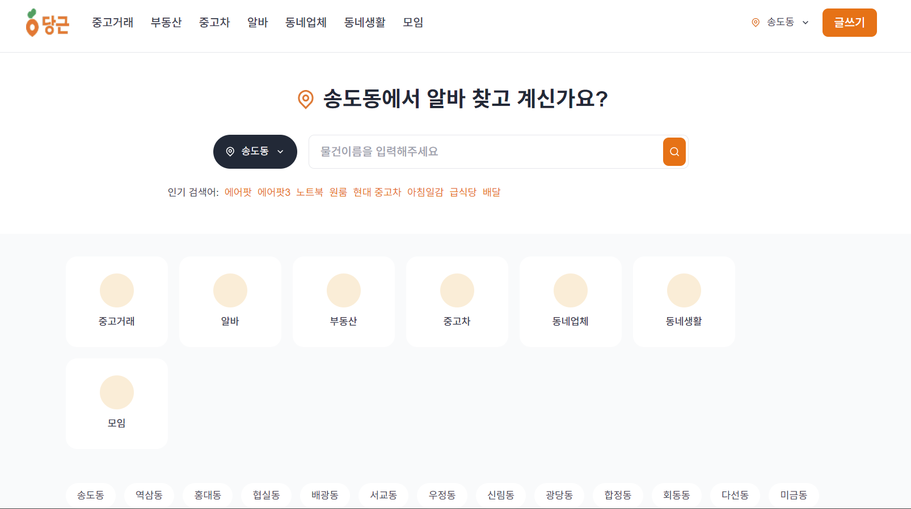
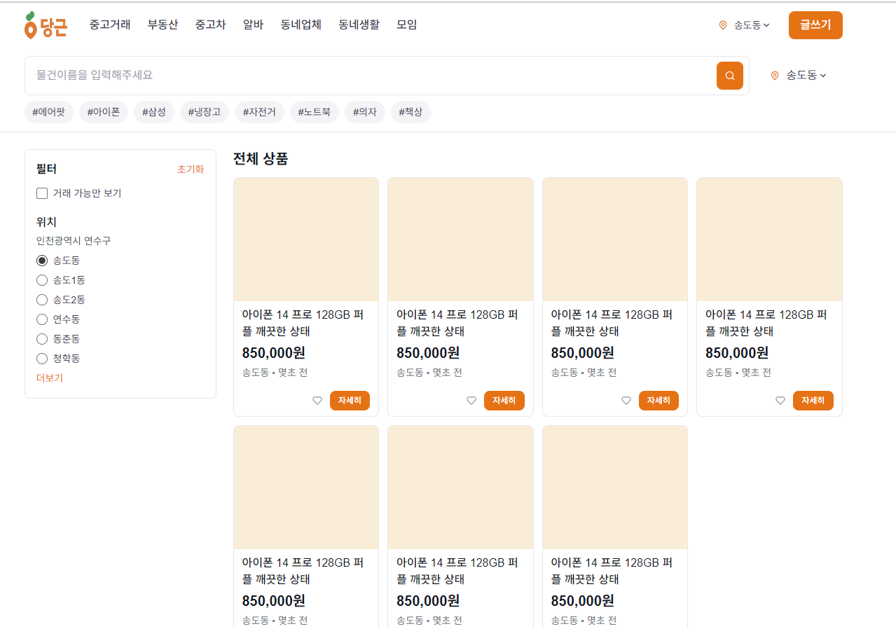
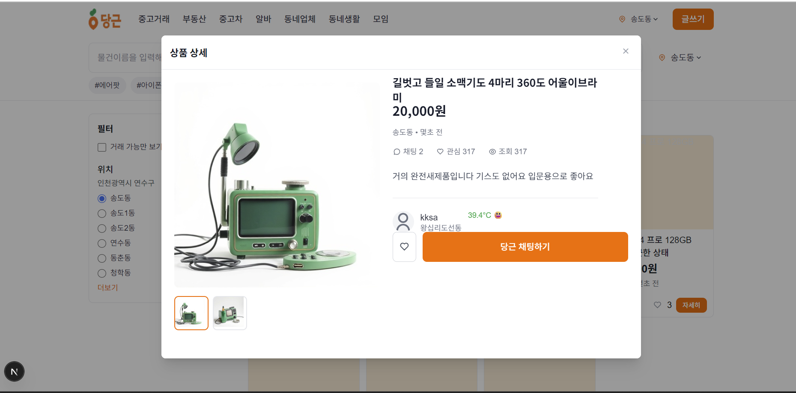
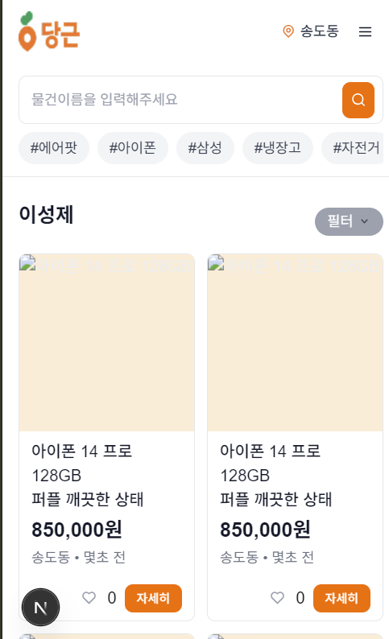
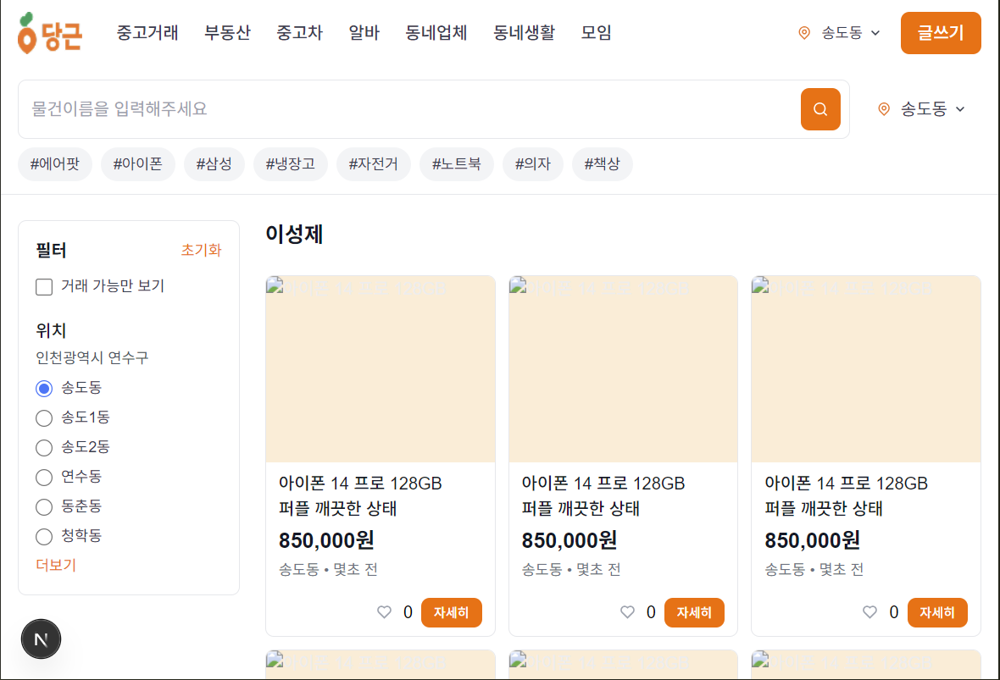

# PARD 6기 웹파트 3차 과제

## ✨ 내용
TailWind 기반으로 **당근마켓 홈페이지**를 제작했습니다.  
# 2차
모달 페이지를 추가하고, 유저들의 관심을 반영할 수 있도록 했습니다.
# 3차
반응형 레이아웃 구현!

---

# 실행 화면
랜딩 페이지



메인



모달



모바일



테블릿



## 🚀 실행 방법
```bash
# 프로젝트 클론
git clone https://github.com/6th-PARD-WEB-PART/Seongje-Lee
cd pard_6th_Seongje_carrot

# 개발 서버 실행
npm run dev
