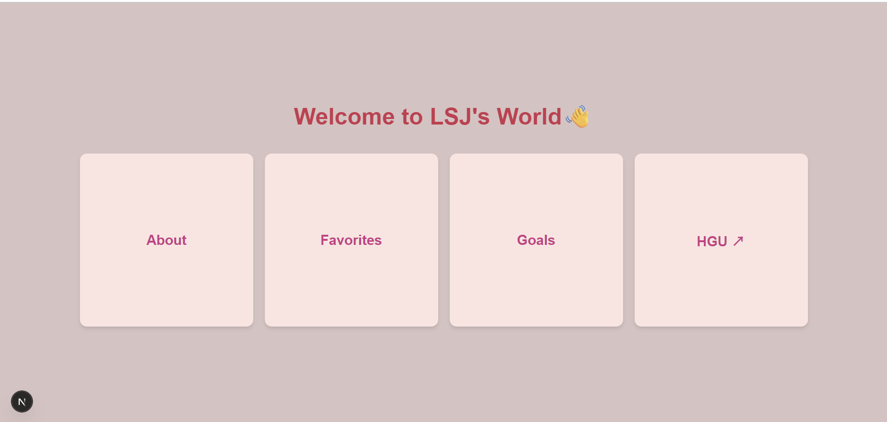
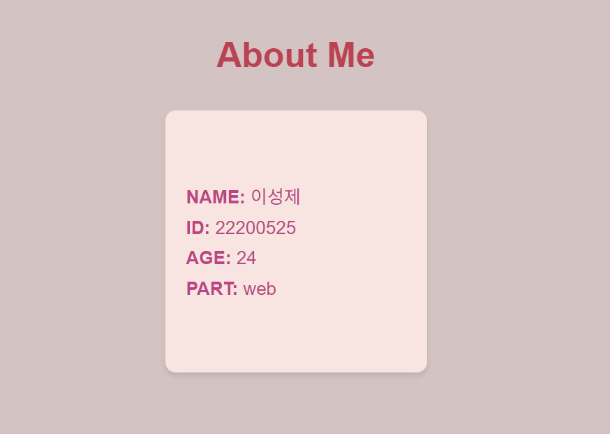
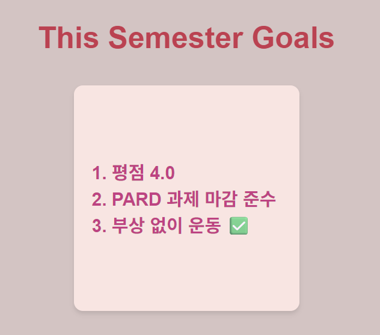
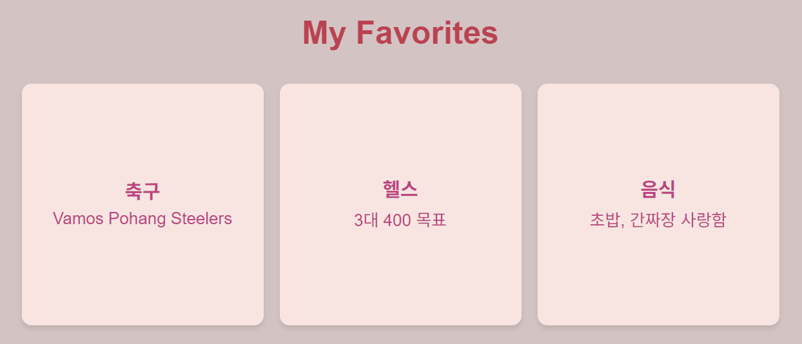

# PARD 6기 웹파트 OT 과제

## ✨ 내용
Next.js + TypeScript 기반으로 **자기소개 페이지**를 제작했습니다.  
메인 페이지에서 블럭을 클릭하여 자기소개, 학기 목표, 좋아하는 것을 확인할 수 있습니다.  

---

# 실행 화면
메인 페이지 



About 페이지



Goals 페이지



Favorites 페이지



## 🚀 실행 방법
```bash
# 프로젝트 클론
git clone https://github.com/6th-PARD-WEB-PART/Seongje-Lee
cd pard_6th_seongje_introduce

# 개발 서버 실행
npm run 
